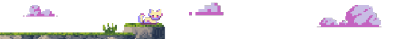

<!--
    Querido usuário usando meu README como base para criar seu próprio:
    Fico muito feliz que você tenha gostado e sinta-se livre para o uso!
    Eu apenas peço uma coisa, por gentileza:

    Por favor, deixe uma estrela no meu README, irá deixar meu dia mais feliz :)
    ------
    Dear user using my README as a base  to create your own:
    I’m glad you liked it and feel free to use it!
    I just kindly ask for one thing:

    Please, leave a star on my README, it will make my day :)
-->

  

  

  

---

### 🌈 Sobre mim

Desenvolvedora front-end, apaixonada por tecnologia, design e ideias criativas!
- Atualmente trabalho com suporte técnico e estou em transição para o desenvolvimento front-end.
- Formada na UNIVESP em Bacharel de Tecnologia da Informação.
- Tenho experiência em **design UX/UI** com **Figma**, conhecimentos em **HTML**, **CSS**, **JavaScript** e atualmente estou aprendendo **React**!
- sou muito curiosa e por conta disso também estou aprendendo **Node.js**, **PostgreSQL** e **PrismaORM** para criação de aplicações completas fullstack
- Estou constantemente atualizando meus conhecimentos e buscando novos desafios na área de tecnologia!

 

  

--- 
  
## ⭐ Tecnologias que uso

### FrontEnd

  
  
  
  
  
  

### BackEnd

  
  
  
  
  
  
  

### Tools

  
  
  

--- 

## 📫 Fale comigo!

  

  

 

<picture>
  <source media="(prefers-color-scheme: dark)" srcset="https://raw.githubusercontent.com/laracmiranda/laracmiranda/output/pacman-contribution-graph-dark.svg">
  <source media="(prefers-color-scheme: light)" srcset="https://raw.githubusercontent.com/laracmiranda/laracmiranda/output/pacman-contribution-graph.svg">
  
</picture>

---

## 📈 Estatísticas

|  |  |  |
| :-: | :-: | :-: |

|  |  |
| :-: | :-: |

--- 

  

  Obrigada por visitar meu perfil! 💜

