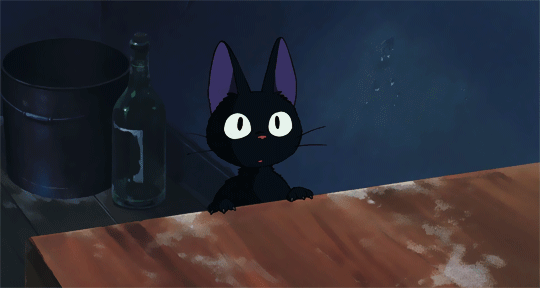
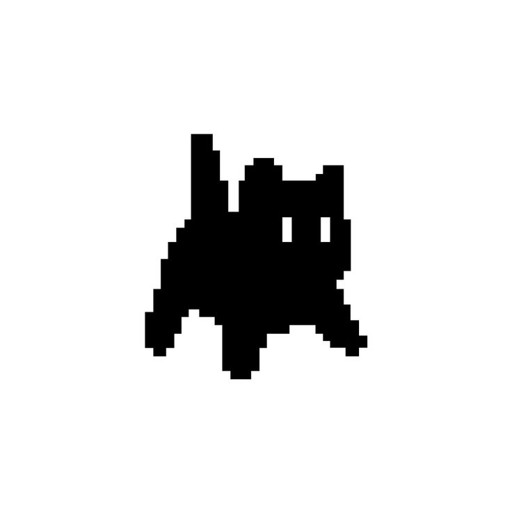

<!--
    Querido usuário usando meu README como base para criar seu próprio:
    Fico muito feliz que você tenha gostado e sinta-se livre para o uso!
    Eu apenas peço uma coisa, por gentileza:

    Por favor, deixe uma estrela no meu README, irá deixar meu dia mais feliz :)
    ------
    Dear user using my README as a base  to create your own:
    I’m glad you liked it and feel free to use it!
    I just kindly ask for one thing:

    Please, leave a star on my README, it will make my day :)
-->

<!--- Banner -->

  

  

<!--- About me -->
### Sobre mim

Sou `Analista de Suporte ao Cliente Júnior` e me aventuro como desenvolvedora `Fullstack`. 
Apaixonada por tecnologia, design e ideias fora da caixa! Sou formada na UNIVESP em **Bacharel de Tecnologia da Informação**.
Estar atuando junto ao cliente como suporte me proporciona uma visão das necessidades do usuário e regras de negócio, me ajudando à criar aplicações que realmente fazem sentido!
Tenho experiência em **UX/UI** com `Figma`, conhecimentos em `HTML`, `CSS`, `JavaScript`, `Node.js`, `PosgreSQL`, `PrismaORM` e atualmente estou aprendendo `React`, `Java` e `automações`! 
Sou muito curiosa e estou constantemente atualizando meus conhecimentos e buscando novos desafios na área de tecnologia!

 

--- 

<!--- My stacks -->

### Tecnologias que uso

  
  
  
  
  
  
  
 
  
  
  
  
  
  
  

#### Tools
  
  
  
  
  
  
  

--- 

    
### Um pouco mais sobre mim! 
Eu gosto de desafios que me fazem crescer! 
Gosto de ajudar outras pessoas dentro da área de tecnologia.
Acredito que a maior forma de aprender é ensinando e costumo postar frequentemente no linkedin meus aprendizados para outras pessoas se inspirarem  
Sou a maior fã existente de `Linkin Park`!

**Fale comigo:**

  
  
  

    

---

<picture>
  <source media="(prefers-color-scheme: dark)" srcset="https://raw.githubusercontent.com/laracmiranda/laracmiranda/output/pacman-contribution-graph-dark.svg">
  <source media="(prefers-color-scheme: light)" srcset="https://raw.githubusercontent.com/laracmiranda/laracmiranda/output/pacman-contribution-graph.svg">
  
</picture>

---

<!-- Statistics -->
### Estatísticas

|  |  |  |
| :-: | :-: | :-: |

|  |  |
| :-: | :-: |

---

  

<!-- My Best Repositories -->

  <h3>
   Meus melhores repositórios
  </h3> 

  

    
    

  

    
    

 

--- 

  

  

  Obrigada por visitar meu perfil! 💜

